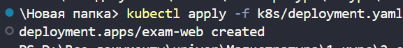
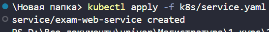
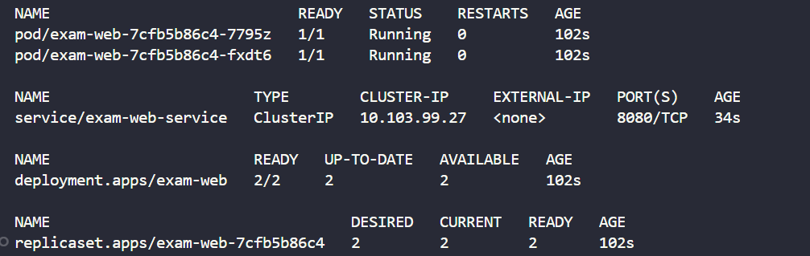
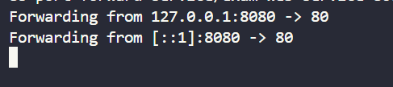
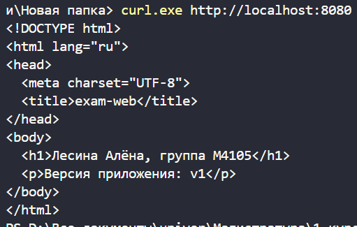

Выполнила: **Лесина Алёна, М4105**

**Цель:** развернуть простой веб‑сайт на базе образа `nginx:1.27-alpine`, где `index.html` хранится в Kubernetes `ConfigMap`.

---

## Манифесты

| Файл | Объект |
|------|--------|
| `k8s/namespace.yaml` | Namespace `exam-k8s` |
| `k8s/configmap.yaml` | ConfigMap `exam-web-configmap` с `index.html` |
| `k8s/deployment.yaml` | Deployment `exam-web` |
| `k8s/service.yaml` | Service `exam-web-service` |

---

## Шаг 1. Namespace `exam-k8s`

Создаём отдельный namespace для приложения:

```bash
kubectl apply -f k8s/namespace.yaml
```

Скриншот:


---

## Шаг 2. ConfigMap с `index.html`

Создаем ConfigMap с HTML‑страницей, в которой хранится имя, учебная группа и версия приложения.

Применяем манифест:

```bash
kubectl apply -f k8s/configmap.yaml
```

Скриншот:


---

## Шаг 3. Deployment `exam-web`

Требования:

- имя: `exam-web`, namespace: `exam-k8s`;
- образ: `nginx:1.27-alpine`;
- реплики: `2`;
- порт контейнера: `80`;
- `index.html` монтируется из `ConfigMap` (volume + `subPath`);
- настроены `readinessProbe` и `livenessProbe`;
- заданы `resources.requests` и `resources.limits`.

Применяем манифест:

```bash
kubectl apply -f k8s/deployment.yaml
```

Скриншот:



---

## Шаг 4. Service `exam-web-service`

Создаём сервис типа `ClusterIP`, который принимает трафик на порту `8080` и направляет его на `targetPort: 80` контейнера `exam-web`.

Применяем манифест:

```bash
kubectl apply -f k8s/service.yaml
```

Скриншот:



---

## Проверка работоспособности

Проверяем состояние ресурсов:

```bash
kubectl get all -n exam-k8s
```

Скриншот:



Пробрасываем порт сервиса на локальную машину (в первом терминале):

```bash
kubectl -n exam-k8s port-forward service/exam-web-service 8080:8080
```

Скриншот:



Во втором терминале проверяем ответ (использую curl.exe, т.к на винде curl выдает кракозябры):

```bash
curl.exe http://localhost:8080
```

Скриншот ответа (где вернулся текст из ConfigMap):


